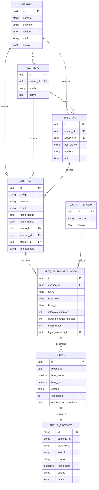

# DER de Integracion FHIR-Relacional - Agendas, Turnos y Centros

## Objetivo
Alinear tablas reales del HIS y modelos del Portal con recursos HL7 FHIR R4 para integracion de agendas/turnos/centros.

## Fuentes analizadas
- HIS:
  - sch_agenda.agenda
  - sch_agenda.bloque_programacion
  - sch_agenda.cupo
  - sch_agenda.centro
  - sch_agenda.servicio
  - sch_agenda.efector
  - sch_agenda.lugar_atencion
  - sch_turno.turno_paciente
- Portal:
  - prisma Appointment
  - prisma MedicalCenter
  - UniversalAppointment (adapter HIS)

## Mapeo principal de entidades
- sch_agenda.agenda -> FHIR Schedule
- sch_agenda.cupo -> FHIR Slot
- sch_turno.turno_paciente -> FHIR Appointment
- sch_agenda.centro -> FHIR Location (nivel sede) + Organization (opcional)
- sch_agenda.lugar_atencion -> FHIR Location (nivel consultorio)
- sch_agenda.servicio -> FHIR HealthcareService
- sch_agenda.efector -> FHIR PractitionerRole / Practitioner

## Campos criticos HIS para integracion
### Schedule (agenda)
- agenda.id
- agenda.codigo
- agenda.nombre
- agenda.estado
- agenda.fecha_desde
- agenda.fecha_hasta
- agenda.centro_id
- agenda.servicio_id
- agenda.efector_id
- agenda.tipo_agenda
- agenda.visible_contact_center

### Slot (cupo)
- cupo.id
- cupo.bloque_id
- cupo.hora_inicio
- cupo.hora_fin
- cupo.estado
- cupo.capacidad
- cupo.overbooking_permitido

### Appointment (turno)
- turno_paciente.id
- turno_paciente.paciente_id
- turno_paciente.profesional
- turno_paciente.servicio
- turno_paciente.centro
- turno_paciente.fecha_hora
- turno_paciente.estado
- turno_paciente.motivo

### Centros y lugares
- centro.id, centro.nombre, centro.direccion, centro.telefono, centro.mail
- lugar_atencion.id, lugar_atencion.nombre, lugar_atencion.activo

## Reglas de integracion
1. Solo Slot disponibles se publican al Portal (estado libre).
2. El alta de Appointment valida disponibilidad en HIS en forma atomica.
3. Idempotency-Key evita alta duplicada por retry.
4. Correlation-Id obligatorio para auditoria cruzada.
5. Centro y Lugar se devuelven siempre referenciados en Appointment/Slot.

## Diagrama ER logico

## Endpoint facade sugerido
- GET /fhir/R4/Schedule
- GET /fhir/R4/Slot
- POST /fhir/R4/Appointment
- GET /fhir/R4/Appointment/{id}
- GET /fhir/R4/Location
