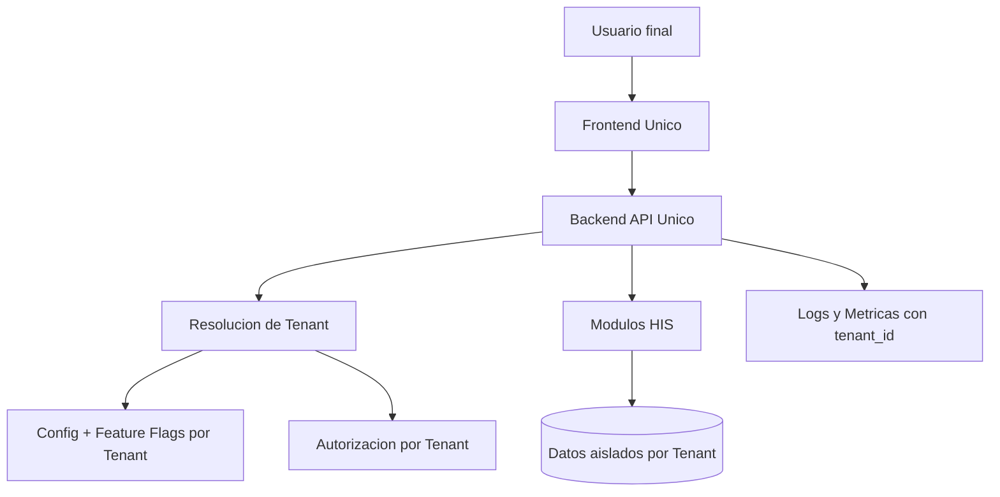

# Arquitectura Multi-Cliente Para VitalFlow HIS

## 1. Objetivo
Convertir VitalFlow HIS en una plataforma multi-cliente escalable, con un solo codebase y capacidad de personalizacion por cliente sin forks.

## 2. Principios Rectores
1. Unico producto, multiples clientes.
2. Configuracion sobre customizacion.
3. Aislamiento de datos por diseno.
4. Seguridad y trazabilidad por tenant.
5. Despliegue automatizado por ambiente y cliente.

## 3. Modelo de Plataforma
### 3.1 Capas
1. Core funcional HIS:
- Agenda
- Turnos
- Admision
- Personas
- HCA
- Seguridad

2. Capa de Tenant (cliente):
- Identidad de cliente (`tenant_id`).
- Branding (logo, colores, nombre comercial).
- Features habilitadas por cliente.
- Parametros de negocio por cliente.
- Integraciones externas por cliente.

3. Capa de Operacion:
- Provisioning de cliente.
- CI/CD por entorno.
- Monitoreo y auditoria por tenant.

### 3.2 Vista logica

## 4. Identidad de Tenant
## 4.1 Resolucion de tenant
Formas recomendadas (orden sugerido):
1. Subdominio: `cliente-a.tu-dominio.com`.
2. Header firmado: `X-Tenant-Id`.
3. Claim en JWT: `tenant_id`.

Regla: resolver tenant al inicio del request y bloquear cualquier acceso cruzado.

## 4.2 Contexto de tenant obligatorio
Cada request debe propagar:
1. `tenant_id`
2. `tenant_code`
3. `user_id`
4. `roles`
5. `trace_id`

## 5. Datos y Persistencia
## 5.1 Modelo recomendado por etapas
1. Etapa inicial: schema por cliente.
2. Etapa de alta exigencia: base por cliente.

## 5.2 Regla de integridad
Ninguna query de negocio debe ejecutarse sin contexto de tenant.

## 5.3 Auditoria
Toda tabla critica debe registrar:
1. `created_at`
2. `updated_at`
3. `created_by`
4. `updated_by`
5. `tenant_id` (si aplica en modelo compartido)

## 6. Configuracion por Cliente
## 6.1 Paquete de configuracion (tenant bundle)
Cada cliente se define por archivos de configuracion versionados:
1. branding
2. features habilitadas
3. catalogos iniciales
4. reglas operativas
5. integraciones (endpoints y credenciales por secreto)

## 6.2 Feature Flags
Ejemplos:
1. `agenda.bloques_avanzados`
2. `turnos.sobreturno`
3. `admision.validacion_cobertura_online`
4. `hca.receta_digital`

## 7. Seguridad Multi-Cliente
1. JWT con `tenant_id` obligatorio.
2. Roles y permisos scopeados por tenant.
3. Prohibir usuarios globales para operacion diaria.
4. Cifrado en transito (TLS) y en reposo.
5. Secretos por tenant en gestor de secretos.

## 8. Integraciones por Cliente
Integraciones externas (laboratorio, facturacion, padrones) deben ir detras de adaptadores desacoplados:
1. Contrato comun interno.
2. Adaptador por proveedor/cliente.
3. Retries y circuit breaker.
4. Logs con `tenant_id` y `integration_id`.

## 9. CI/CD Multi-Cliente
## 9.1 Pipeline unico parametrizable
1. Build y test comunes.
2. Empaquetado Docker comun.
3. Deploy por ambiente y tenant.

## 9.2 Entornos
1. `dev-shared`
2. `qa-tenant-x`
3. `prod-tenant-x`

## 9.3 Estrategia de release
1. Trunk-based + feature flags.
2. Rollout controlado por tenant.
3. Rollback rapido por version de imagen.

## 10. Observabilidad y Soporte
1. Logs estructurados con `tenant_id`.
2. Dashboards por cliente.
3. Alertas por SLA del cliente.
4. Trazas distribuidas por request.

## 11. Roadmap de Implementacion
## Fase 1 (2 a 4 semanas)
1. Resolver tenant por request.
2. Incluir `tenant_id` en auth y logs.
3. Crear tabla/config de tenant + feature flags.

## Fase 2 (3 a 6 semanas)
1. Aislamiento de datos definitivo (schema o DB por cliente).
2. Provisioning automatizado de cliente.
3. Pipeline de deploy parametrizado por tenant.

## Fase 3 (continuo)
1. Integraciones por cliente via adaptadores.
2. Dashboards y SLA por cliente.
3. Harden de seguridad y auditoria avanzada.

## 12. Antipatrones a Evitar
1. Fork por cliente.
2. `if cliente == X` dispersos en todo el codigo.
3. Datos mezclados sin aislacion fuerte.
4. Secretos de clientes en repo.
5. Deploy manual sin trazabilidad.

## 13. Definicion de Exito
El modelo multi-cliente se considera implementado cuando:
1. Alta de cliente nuevo <= 1 dia operativo.
2. Cero acceso cruzado de datos entre clientes.
3. Deploy por cliente sin downtime significativo.
4. Activacion de features por tenant sin cambios de codigo.
