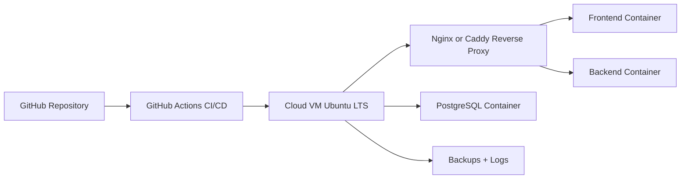

# Estrategia Para Llevar VitalFlow HIS a Nube (Docker + GitHub)

## Objetivo
Definir una estrategia de migracion a nube para ejecutar VitalFlow HIS en un servidor que soporte Docker, con despliegue continuo desde GitHub, seguridad basica de produccion y capacidad de crecimiento.

## Resultado Esperado
- Entorno cloud estable para front, back y base de datos.
- Deploy automatizado desde GitHub con pipeline CI/CD.
- Backups, monitoreo y controles de seguridad minimos.
- Base para escalar de un servidor unico a arquitectura administrada.

## Recomendacion Ejecutiva
Para la etapa actual del proyecto, la mejor relacion velocidad/costo/riesgo es:

1. Fase 1: Un solo servidor Linux en nube (Ubuntu LTS) con Docker Compose.
2. Fase 2: Mantener front y back en el servidor, mover DB a servicio administrado.
3. Fase 3: Separar entornos y endurecer seguridad operativa.

Si ya tienen orientacion Microsoft en la organizacion, priorizar Azure (VM + Azure Database for PostgreSQL en fase 2).

## Opciones De Proveedor (Resumen)
1. Azure:
- Ventaja: Integracion empresarial, gobierno, IAM robusto.
- Ideal si ya usan ecosistema Microsoft.

2. AWS:
- Ventaja: Madurez y servicios administrados muy completos.
- Ideal para crecimiento grande y multiplataforma.

3. DigitalOcean o Hetzner:
- Ventaja: Menor costo operativo inicial y simpleza.
- Ideal para MVP productivo con bajo presupuesto.

## Arquitectura Objetivo (Fase 1)

### Componentes
- Reverse proxy con TLS (Nginx o Caddy).
- Frontend en contenedor (build estatico + Nginx).
- Backend en contenedor .NET 8.
- PostgreSQL en contenedor (solo fase inicial).
- Volumenes persistentes para DB y backups.

## Requisitos Minimos De Infraestructura
Produccion inicial recomendada:

1. VM Linux Ubuntu 22.04/24.04 LTS.
2. 4 vCPU, 8 GB RAM, 120 GB SSD (minimo).
3. IP publica fija.
4. Dominio y DNS gestionado.
5. Firewall: abrir solo 22 (restringido), 80 y 443.

Para carga mayor o concurrencia sostenida, escalar a 8 vCPU y 16 GB RAM.

## Estrategia CI/CD Con GitHub
## Rama y flujo recomendado
1. main: produccion.
2. develop: integracion.
3. feature/*: desarrollo por HU.

## Pipeline GitHub Actions
1. Build y tests:
- dotnet build y pruebas de backend.
- npm run build y pruebas de frontend.

2. Imagenes Docker:
- Build de imagen frontend y backend.
- Publicacion en GHCR (GitHub Container Registry).

3. Deploy por entorno:
- Conexion SSH al servidor.
- Pull de imagenes nuevas.
- docker compose up -d.
- Health checks post deploy.

## Secrets en GitHub
- SSH_HOST
- SSH_USER
- SSH_PRIVATE_KEY
- GHCR_TOKEN
- JWT_SIGNING_KEY
- Variables de DB y entorno (nunca en repo)

## Seguridad Minima Obligatoria
1. No guardar secretos en codigo ni en docker-compose versionado.
2. Usar archivo .env en servidor y secrets en GitHub.
3. Endurecer SSH:
- Deshabilitar password login.
- Solo llave privada.
- Fail2ban recomendado.
4. TLS obligatorio en 443.
5. Rotacion de claves JWT y credenciales DB.
6. Politica de backup diario y restauracion validada.

## Base De Datos: Ruta Recomendada
## Fase 1 (rapida)
- PostgreSQL en contenedor local del servidor.
- Backup diario dump + copia offsite.

## Fase 2 (estable)
- Migrar a PostgreSQL administrado.
- Mantener migraciones desde carpeta db/migrations.
- Ejecutar plan de rollback probado.

## Fase 3 (auditabilidad)
- Monitoreo de queries y tuning de indices.
- Alertas por CPU, RAM, disco y conexiones.

## Observabilidad
Implementar desde inicio:

1. Logs centralizados de contenedores.
2. Health endpoints en backend.
3. Alertas basicas:
- Caida de contenedor.
- Error rate alto.
- Disco > 80%.
4. Dashboard minimo (Grafana + Prometheus o servicio cloud equivalente).

## Backups y Recuperacion
1. Backup diario completo de PostgreSQL.
2. Backup de volumenes y archivos de configuracion.
3. Retencion recomendada:
- 7 diarios
- 4 semanales
- 3 mensuales
4. Test de restauracion mensual obligatorio.

## Plan De Ejecucion Por Fases
## Fase 0 - Preparacion (1 semana)
1. Definir proveedor cloud y dominio.
2. Definir naming, ambientes y responsables.
3. Preparar secrets y politica de acceso.

## Fase 1 - Produccion Inicial (1 a 2 semanas)
1. Provisionar VM y hardening basico.
2. Instalar Docker y Docker Compose.
3. Configurar reverse proxy + TLS.
4. Configurar GitHub Actions para deploy automatico.
5. Salir a produccion con checklist de validacion.

## Fase 2 - Robustez (2 a 4 semanas)
1. Mover DB a servicio administrado.
2. Implementar monitoreo y alertas completas.
3. Definir runbooks de incidentes y rollback.

## Fase 3 - Escalabilidad (segun demanda)
1. Separar entornos Dev/QA/Prod.
2. Auto scaling o balanceo segun trafico.
3. WAF y politicas avanzadas de seguridad.

## Costos Estimados (referencia)
1. VM unica 4 vCPU / 8 GB: rango medio mensual de bajo a moderado.
2. DB administrada pequena: costo adicional moderado.
3. Monitoreo administrado: costo incremental segun volumen.

Nota: el costo exacto depende de proveedor, region y transferencia.

## Riesgos Y Mitigaciones
1. Riesgo: Caida por servidor unico.
- Mitigacion: backups + restauracion probada + plan de recovery.

2. Riesgo: Fuga de secretos.
- Mitigacion: GitHub Secrets + .env en servidor + rotacion.

3. Riesgo: Deploy con regresion.
- Mitigacion: pipeline con build/test + health checks + rollback.

4. Riesgo: Perdida de datos.
- Mitigacion: backup automatizado + retencion + restore tests.

## Checklist De Salida A Produccion
1. TLS activo y redireccion HTTP -> HTTPS.
2. Health checks operativos en front y back.
3. Secrets fuera del repo.
4. Backup diario verificado.
5. Pipeline de deploy funcionando en main.
6. Documento de rollback probado.
7. Monitoreo y alertas activos.

## Proximo Paso Recomendado
Crear una implementacion inicial en Azure o proveedor elegido con:

1. VM Ubuntu LTS.
2. Docker Compose productivo.
3. GitHub Actions con deploy SSH.
4. Dominio + TLS.

Luego, en segunda iteracion, migrar PostgreSQL a servicio administrado.
