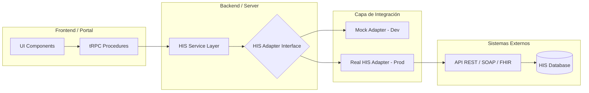

# Blueprint Técnico: Integración Universal HIS/PRM
**Proyecto:** Patient Management Platform (PRM)  
**Estado:** Arquitectura de Referencia v1.0  
**Objetivo:** Definir el estándar de comunicación entre el Portal del Paciente y el Core Hospitalario (HIS).

---

## 1. Arquitectura de Adaptador HIS (Universal Connector)

Para garantizar la independencia del software médico, utilizamos el **Patrón Adaptador**. El portal no "conoce" al HIS directamente, sino que habla a través de una interfaz estandarizada.

### Diagrama de Flujo de Datos


### Definición de Interfaz (Typescript)
El adaptador debe implementar obligatoriamente estos métodos para que el portal funcione:

```typescript
export interface IHISAdapter {
  // Paciente
  getPatientProfile(id: string): Promise<PatientProfile>;
  
  // Turnos (Citas)
  getAppointments(patientId: string): Promise<Appointment[]>;
  getAvailableSlots(filters: AppointmentFilters): Promise<Slot[]>;
  bookAppointment(data: BookAppointmentInput): Promise<Appointment>;
  
  // Historia Clínica
  getMedicalHistory(patientId: string): Promise<Record[]>;
  getPrescriptions(patientId: string): Promise<Prescription[]>;
  getLabResults(patientId: string): Promise<LabResult[]>;
}
```

---

## 2. Configuración vía Variables de Entorno (`.env`)

Toda la sensibilidad de la conexión se gestiona fuera del código para permitir cambios rápidos de entorno (Dev -> Staging -> Prod).

| Variable | Descripción | Ejemplo |
|----------|-------------|---------|
| `HIS_ADAPTER_TYPE` | Define qué adaptador cargar | `MOCK` \| `REST` \| `FHIR` |
| `HIS_API_ENDPOINT` | URL base del API del HIS | `https://api.hospital.com/v1` |
| `HIS_AUTH_TYPE` | Método de autenticación | `Bearer` \| `Basic` \| `ApiKey` |
| `HIS_API_KEY` | Clave secreta de integración | `sk_live_abc123...` |
| `HIS_TIMEOUT_MS` | Tiempo máximo de espera | `5000` |

---

## 3. Sincronización HL7 / FHIR

El portal utiliza internamente el estándar **HL7 FHIR (Fast Healthcare Interoperability Resources)** para el mapeo de datos. Esto asegura compatibilidad con sistemas modernos como SAP Healthcare, Epic o Cerner.

### Mapeo de Recursos Principales
| Entidad Portal | Recurso FHIR | Atributos Críticos |
|----------------|--------------|--------------------|
| Paciente | `Patient` | `id`, `identifier` (DNI), `name`, `birthDate` |
| Turno | `Appointment` | `status`, `start`, `end`, `participant` |
| Médico | `Practitioner` | `id`, `name`, `qualification` (Especialidad) |
| Receta | `MedicationRequest` | `authoredOn`, `requester`, `medication` |
| Informe | `DiagnosticReport` | `issued`, `performer`, `result` (PDF/Data) |

### Proceso de Sincronización
1. **Pull (On-Demand):** El portal solicita datos al HIS en tiempo real cuando el paciente abre una sección (ej. "Mis Turnos").
2. **Push (Webhook):** El HIS notifica al portal cuando hay un cambio (ej. un nuevo resultado de estudio disponible) para disparar notificaciones push.
3. **Caché:** Los datos se guardan temporalmente en la base de datos del PRM para optimizar la velocidad de carga.

---

## 4. Próximos Pasos para Integración Real
1. **Auditoría de API:** Identificar si el HIS actual posee endpoints REST o requiere un middleware de transformación.
2. **Gateway de Seguridad:** Configurar una VPN o Whitelist de IP para que el servidor del Portal pueda hablar con el servidor del HIS de forma segura.
3. **Mapeo de Especialidades:** Homologar los IDs de especialidades entre ambos sistemas.

> [!IMPORTANT]
> Esta arquitectura permite que el **Sanatorio Quantum Medical** cambie su software de gestión en el futuro sin que el paciente note ninguna diferencia en su portal, protegiendo así la inversión tecnológica.
